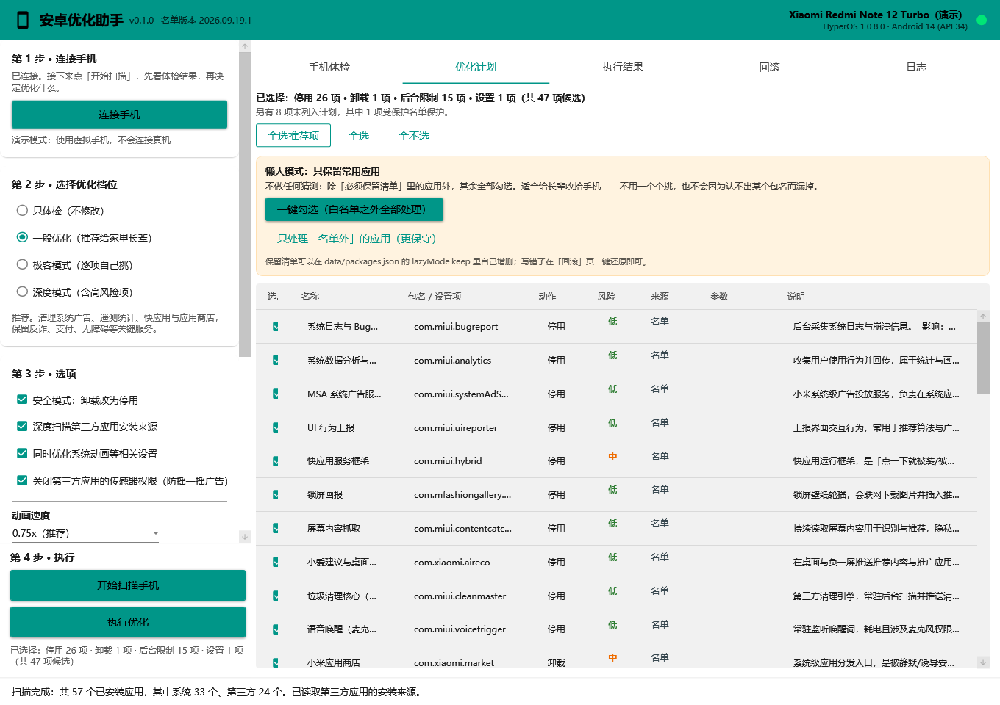

# 安卓优化助手

给家里长辈收拾安卓手机的小工具。**免 Root、免安装、一键优化、随时可退。**

很多国产安卓手机出厂就带着一堆会自己装应用、弹广告、后台耗电的东西，老人家往往不知道怎么关。
这个工具能把这些关掉——同时**坚决不碰**反诈、支付、输入法、电话短信这些底线应用。

这份文档包含了全部使用说明，不需要再看别的地方。

---

## 目录

- [一分钟上手](#一分钟上手)
- [第 0 步：下载和打开程序](#第-0-步下载和打开程序)
- [第 1 步：在手机上打开 USB 调试](#第-1-步在手机上打开-usb-调试)
- [第 2 步：连接手机](#第-2-步连接手机)
- [第 3 步：扫描手机](#第-3-步扫描手机只读不会改东西)
- [第 4 步：选要清理什么](#第-4-步选要清理什么)
- [第 5 步：执行优化](#第-5-步执行优化)
- [第 6 步：优化之后](#第-6-步优化之后)
- [出问题怎么还原](#出问题怎么还原)
- [它到底会动什么](#它到底会动什么)
- [常见问题](#常见问题)
- [给开发者](#给开发者)

---

## 一分钟上手

1. 到本项目的 **Releases** 页面下载 `AndroidOptimize-x.x.x.exe`。
   这是**单个文件**，双击就能用——不用安装，不用装任何运行库。
2. 在手机上打开「USB 调试」（[第 1 步](#第-1-步在手机上打开-usb-调试)有图文）。
3. 插上数据线 → 点「连接手机」→ 点「开始扫描」→ 选好后点「执行优化」。

全程大约 10 分钟，只需要动手点几下。**做错了也能一键还原。**

---

## 第 0 步：下载和打开程序

### 下载

打开本项目的 **Releases（发行版）** 页面，下载最新版的 `AndroidOptimize-x.x.x.exe`。

这是一个**单文件程序**：只有这一个 exe，没有安装包，也不用装 .NET 之类的运行库。

### 打开

把 exe 放到任意文件夹（比如桌面），**双击**就能打开。

### 如果 Windows 弹出蓝色警告

第一次打开时，可能会看到「Windows 已保护你的电脑」或者「未知发布者」的提示。

这是因为程序没有购买商业代码签名证书（一年要几百到上千元）。处理办法：

> 点提示框里的 **「更多信息」** → 再点 **「仍要运行」**。

如果杀毒软件报警，把它加入信任列表即可。程序的全部源代码都在这个仓库里，可以随时核对。

### 打开后长这样

左边是操作区，按「第 1 步 → 第 4 步」从上往下做；右边是结果区，五个标签页分别是
手机体检、优化计划、执行结果、回滚、日志。

---

## 第 1 步：在手机上打开 USB 调试

所有安卓手机都是同一条路：**先让「开发者选项」出现，再进去打开 USB 调试。**

### 具体操作

**① 打开「设置」，找到「关于手机」**

各品牌的位置略有不同，对照下表找：

| 手机品牌 | 位置 |
|---|---|
| 小米 / 红米 / POCO | 设置 → 我的设备 → 全部参数与信息 |
| 华为 / 荣耀 | 设置 → 关于手机 |
| OPPO / 一加 / 真我 | 设置 → 关于本机 |
| vivo / iQOO | 设置 → 系统管理 → 关于手机 |
| 三星 | 设置 → 关于手机 → 软件信息 |

**② 连续点击「版本号」7 次**

一直点到屏幕下方提示「您已处于开发者模式」为止。中间可能要求输入锁屏密码，正常输入即可。

> 找不到「版本号」？看看是不是叫「MIUI 版本」「软件版本号」「内部版本号」——都是它。

**③ 返回设置，进入「开发者选项」，打开「USB 调试」**

### ⚠️ 小米 / 红米 / POCO 用户请务必注意

小米系的手机在开发者选项里还有**两个**开关，两个都要打开：

1. **USB 调试**
2. **USB 调试（安全设置）** ← 这个不开，优化时会一直提示「权限不足」

打开第二个开关时，可能需要登录小米账号并插入 SIM 卡，按提示操作即可。

### OPPO / vivo 用户建议

开发者选项里如果有「通过 USB 安装应用」「通过 USB 修改权限」之类的开关，一并打开。

> **小技巧**：找不到某个开关时，在开发者选项页面右上角点搜索图标，输入 `USB`，
> 所有相关开关都会列出来。

---

## 第 2 步：连接手机

### 步骤

1. **用数据线把手机连到电脑。**

   > ⚠️ 很多数据线是「只能充电、不能传数据」的。如果怎么都连不上，**换一根线**再试，
   > 这是最常见的原因。

2. **手机屏幕上会弹出「允许 USB 调试吗？」**

   勾选 **「一律允许使用这台计算机进行调试」**，再点 **「允许」**。

   > 勾上「一律允许」以后，同一台电脑再连接就不用重复点了。

3. **在电脑上点左侧的「连接手机」。**

   顶部右上角的圆点从红色变绿色，并显示出手机型号，就说明连上了。

### 一直连不上？按顺序排查

1. 拔掉数据线，重新插一次；
2. 换一根数据线；
3. 手机下拉通知栏，把 USB 用途从「仅充电」改成「传输文件 / MTP」；
4. 开发者选项里点「撤销 USB 调试授权」，再重新插线；
5. 确认「USB 调试」开关确实是打开的——系统更新后它有时会被自动关掉；
6. 手机保持**屏幕解锁**状态。

程序连不上时会直接告诉你卡在哪一步，照着提示做就行。

---

## 第 3 步：扫描手机（只读，不会改东西）

点左侧的 **「开始扫描手机」**。

**这一步不会修改手机上的任何东西**，可以放心点。扫描过程大约 10~60 秒（取决于手机里装了多少应用）。

扫描完成后会自动跳到「优化计划」页，你也可以点回「手机体检」页看完整清单：

### 这张表怎么看

| 列 | 含义 |
|---|---|
| **包名** | 应用在系统里的唯一名字，例如 `com.xiaomi.market` |
| **名称** | 中文名（名单里已收录的会显示） |
| **类型·状态** | 系统应用还是第三方应用，现在是启用还是停用 |
| **名单判定** | 程序的判断结果，见下表 |
| **安装来源** | 这个应用是从哪装进来的。**判断「是不是被强行装的」主要看这一列** |
| **说明** | 这个应用是什么、处理它会影响什么 |

「名单判定」这一列的取值：

| 显示 | 意思 |
|---|---|
| **受保护（支付 / 反诈 / 输入法 …）** | 程序绝对不会碰它，任何档位都不动 |
| **名单：某某应用** | 名单里已有记录，会被列入优化计划 |
| **名单外** | 名单里没有。会进「未知应用」，也可以用 AI 识别（见第 4 步） |

> 💡 鼠标停在任意一行上，会浮出这个应用的完整信息，包括安装来源和**首次安装时间**。
> 如果某个你没印象的应用是最近才装的、来源又是应用商店，那它很可能就是「被强行安装」的。

---

## 第 4 步：选要清理什么

### 先选档位（左侧「第 2 步」）

| 档位 | 适合谁 | 会做什么 |
|---|---|---|
| **只体检** | 想先看看 | 只扫描，不改任何东西 |
| **一般优化** ⭐ | 给长辈用 | 清掉系统广告、统计上报、快应用、应用商店、预装娱乐类应用 |
| **极客模式** | 你自己用 | 在一般优化的基础上，多出云服务、互联互通、语音助手等可选项 |
| **深度模式** | 明白风险 | 含高风险项，逐项确认 |

**给长辈用，选「一般优化」就够了。**

### 再看「优化计划」页

每一行就是一项操作，最左边有勾选框。**只有勾上的才会执行。**

| 列 | 说明 |
|---|---|
| **名称 / 包名** | 要处理的是哪个应用 |
| **动作** | 停用 / 卸载 / 后台限制 / 修改设置 |
| **风险** | 绿=低，橙=中，红=高。**红色的默认不勾，需要你自己判断** |
| **来源** | 「名单」= 已人工核对过；「策略」= 按规则批量应用；「AI 建议」= 机器识别，**默认全部不勾** |
| **说明** | 为什么建议处理、处理完会失去什么 |

上面的按钮：

- **全选推荐项**：把所有安全项勾上（推荐）。
- **全选 / 全不选**：字面意思。

### 懒人模式：只保留常用应用

老人的手机常有这种情况：不知不觉多了几十个用不上的应用，一个个勾太慢；
而且大多数人没有 AI Key，名单外的应用根本没法自动判断。

**与其让程序去猜，不如直接告诉它「哪些必须留」。** 懒人模式就是这样：
它只看一份「必须保留清单」，清单之外的**全部勾选处理**——不猜、不漏。

点 **「一键勾选（白名单之外全部处理）」**，程序会：

- 勾上名单里该处理的项（应用商店、锁屏画报、游戏中心、系统更新等）；
- 勾上所有白名单之外的第三方应用；
- 保留白名单里的应用，以及保护名单里的全部内容。

**默认的保留清单**（写在 `data/packages.json` 的 `lazyMode.keep`，可以自己改）：

| 类别 | 包含 |
|---|---|
| 聊天 | 微信、QQ、企业微信、钉钉 |
| 短视频 | 抖音、快手（含极速版） |
| 地图导航 | 高德地图、百度地图、腾讯地图、谷歌地图 |
| 出行票务 | 12306、携程、去哪儿、滴滴 |
| 办公 | WPS、微软 Office、Edge、百度网盘 |
| 健康 | 运动健康、计步、医院挂号 |
| 自动包含 | 保护名单里的一切：银行、支付、反诈、政务医保、输入法、电话短信… |

清单之外的应用会被**停用**（不是卸载）：不能再运行、图标消失、不会再弹广告，
效果和卸载一样，但随时能在「回滚」页一键还原。

> ⚠️ **执行前请务必扫一眼列表**，把医院挂号、社区服务、子女给你装的软件这类
> 清单里没写到、但对使用者要紧的应用取消勾选。
>
> 发现清单少写了什么，把它加进 `lazyMode.keep` 再跑一次就行——
> 名单是这个项目里唯一需要维护的东西，改它**不需要重新编译程序**。

### 不想那么激进？

用 **「只处理「名单外」的应用」**：只勾选名单里查不到的第三方应用，
名单里已有的处理项保持原样。适合先看看效果。

每个未知应用的「说明」列里都写着它的安装来源、首次安装时间，以及系统记录的启动情况。

> 启动记录**仅供参考**：被其它应用唤醒也会算作"启动过"，而且流氓应用之间会互相唤醒，
> 所以它不能单独用来判断一个应用是不是垃圾。懒人模式不依赖这个字段。

### 左侧「第 3 步」的几个开关

- **安全模式：卸载改为停用** ✅ 建议保持勾选。
  停用比卸载更容易恢复，也不会触发系统自动把应用装回来。效果对使用者来说是一样的。
  > 例外：**应用商店不受这一条影响，会被直接卸载**——停用有可能被系统重新启用，而商店正是
  > 「被强行装应用」的源头，所以程序对它始终执行卸载。
- **深度扫描第三方应用安装来源** ✅ 建议勾选。
  会多花 10~30 秒，但能查出每个第三方应用是从哪装进来的。
- **同时优化系统动画等相关设置** ✅ 建议勾选。把系统动画调快到 0.75 倍，手感更跟手。
- **关闭第三方应用的传感器权限（防摇一摇广告）** ✅ 建议勾选。
  摇一摇跳转广告靠加速度传感器触发，关掉传感器访问能让它直接失效。
  **微信、QQ、地图导航、运动健康类应用会自动排除**，不受影响。
- **允许操作微信等受保护应用** ⬜ 默认关闭。
  打开后微信、QQ 才会出现在候选列表里，而且仍然需要你手动勾选。**平时不用开。**

### 关于 AI 识别（可选）

如果手机里有很多「名单外」的应用，可以填一个 DeepSeek API Key 让程序自动识别它们。

**不填也完全能用**，只是这些应用不会被自动判断。

填了之后请注意：

- 程序**只把「名单里查不到的应用包名」**发出去，不发联系人、照片、短信等任何个人数据；
- AI 的结果只会出现在「来源 = AI 建议」的行里，**默认全部不勾选**，必须你确认；
- AI **永远不能建议处理受保护的应用**（反诈、支付、输入法这些）；
- API Key 用 Windows 加密后只保存在你自己的电脑上。

---

## 第 5 步：执行优化

确认勾选无误后，点左侧的 **「执行优化」**，会弹出确认框，显示即将执行的内容。

执行时会发生这些事（都可以在「日志」页看到）：

1. **先保存快照**——把所有要改的项目记录成一个可还原的文件；
2. 逐项执行；
3. **回读手机状态做校验**——不是看命令有没有报错，而是重新读一遍手机，确认真的生效了。

执行完，「执行结果」页每一行都会显示：

- **结果**：成功 / 已降级成功 / 失败
- **回读校验**：通过 / 未确认
- **说明**：具体做了什么

如果某一项显示失败，通常是系统权限限制导致的，不影响其它项。程序会给出中文原因和处理建议。

> 「已降级成功」的意思是：这个应用系统不允许卸载，程序改成停用了——效果一样，也能一键还原。

---

## 第 6 步：优化之后

程序已经用 ADB 把该做的都做完了，**不需要你再进手机设置里点任何东西**。
具体处理了哪些内容，见[它到底会动什么](#它到底会动什么)。

接下来只剩两件小事：

- **重启一次手机**，让被停用的组件彻底退出后台；
- 重启后可以再打开程序扫描一次，确认该安静的都安静了。

如果发现哪个应用不该被处理，去[「回滚」页](#出问题怎么还原)还原就好。

---

## 出问题怎么还原

**这是本程序最重要的功能。** 每次执行优化前，程序都会自动保存一份「快照」。

### 还原方法

1. 插上手机，点「连接手机」；
2. 打开 **「回滚」** 页；
3. 在列表里选中要还原的那一次（按时间排列，最新的在最上面）；
4. 点 **「一键还原选中的快照」**，确认。

程序会把：

- **停用的应用** → 重新启用
- **卸载的应用** → 重新装回（数据都还在）
- **改过的设置** → 写回原来的值

还原完成后建议重启一次手机，然后重新扫描确认。

### 什么情况需要还原

| 现象 | 处理 |
|---|---|
| 某个应用打不开了 | 回滚一次，或只还原那一个应用 |
| 收不到某个应用的通知 | 同上 |
| 想装新软件但商店被卸载了 | 回滚一次 → 装完软件 → 重新执行优化 |
| 手机出现其它异常 | 先回滚，再反馈给我们 |

---

## 它到底会动什么

### 默认会做的事

| 项目 | 说明 |
|---|---|
| 卸载应用商店 | 「被强行装应用」的最主要来源。唯一不受安全模式降级的条目——停用可能被系统重新启用 |
| 关闭系统广告与统计 | 系统广告服务、行为上报、锁屏画报、快应用框架等 |
| 关闭传感器权限（防摇一摇广告） | 除微信、QQ、地图导航、运动健康类应用外，其它第三方应用都会被关闭传感器访问 |
| 限制重度应用后台 | 抖音、拼多多、快手、淘宝等不再长时间后台拉流与唤醒（极客档可选） |

### 绝对不会动的东西

下面这些在「保护名单」里，**任何档位、包括 AI 建议在内，都不会去碰**：

**安全与民生**：国家反诈中心、各类反诈应用、手机管家、安全中心的安装校验组件、
支付与银行类应用、云闪付、政务与医保类应用、无障碍服务（TalkBack 等）。

**手机的基础功能**：电话、短信、联系人、桌面、系统界面、系统设置、
应用安装器、输入法、相机、相册、时钟、文件选择器、紧急呼叫、蓝牙、NFC。

**微信、QQ** 属于「受保护」级别：默认不出现、AI 不许建议；
即使你打开「允许操作受保护应用」，也还需要在深度模式下手动勾选才会生效。

### 操作范围

所有操作都只针对**当前用户空间**（`user 0`），不 Root、不动系统分区，也不会碰你的照片和聊天记录。

---

## 常见问题

**Q：会把手机弄坏吗？**

不会。所有操作都只针对当前用户空间，完全不动系统分区，也不会 Root 手机。
停用和卸载都可以一键还原，而且程序在执行前一定会先保存快照。

**Q：需要 Root 吗？**

不需要。这就是这个工具的意义——用 ADB 就能做到以前只有 Root 才能做的事。

**Q：会删掉我的照片、微信聊天记录吗？**

不会。程序只处理应用本身和部分系统开关，不碰任何个人数据。卸载应用时也会用保留数据的参数。

**Q：优化完收不到微信消息了？**

微信默认在保护名单里，不会被动。如果你手动打开过「允许操作受保护应用」并对微信做了后台限制，
在「回滚」页还原一次即可恢复。

**Q：应用商店被卸载了，以后怎么装软件？**

三种办法：

1. 用手机浏览器下载安装包直接装（推荐，装完不受商店影响）；
2. 到「回滚」页还原一次，商店就回来了，装完再重新执行优化；
3. 需要商店时临时还原，长期不用就让它卸载着——卸载只针对当前用户空间，随时可恢复。

**Q：摇一摇广告真的能挡住吗？**

程序会关闭第三方应用的传感器访问权限（`BODY_SENSORS`、`HIGH_SAMPLING_RATE_SENSORS`、
`ACTIVITY_RECOGNITION`），摇一摇这类靠加速度传感器触发的跳转广告会因此失效。

**需要说明的是**：标准安卓并没有给加速度传感器设置权限门控，能关到什么程度取决于系统版本和厂商实现，
所以这一项**建议在真机上验证一次**——执行完在「执行结果」页看这一项的「回读校验」是不是通过，
然后实际打开几个应用试试摇一摇还灵不灵。如果系统不支持，程序会如实显示失败，不会假装成功。

**Q：优化完了广告还是很多？**

大概率是**应用内的开屏广告和弹窗**——这类广告由应用自己绘制，任何 ADB 工具都挡不住，
只能靠关闭该应用的通知权限、或者干脆卸载它。
如果某个应用本身就是广告重灾区，欢迎反馈给我们，我们会评估是否加进名单。

**Q：手机里被装了几十个没用的应用，能一次清掉吗？**

能。用 **懒人模式**：在「优化计划」页点「一键勾选（白名单之外全部处理）」。

它不做任何猜测，只看一份「必须保留清单」（微信、抖音、快手、地图导航、出行、
办公、健康，以及保护名单里的银行/支付/反诈等），**清单之外的第三方应用全部勾上**。

清单写在 `data/packages.json` 的 `lazyMode.keep` 里，可以自己增删；
处理方式是**停用**，所以万一关错了，在「回滚」页一键还原就行，数据一点不丢。

**Q：提示「停用失败 / 权限不足」？**

多半是没打开「USB 调试（安全设置）」，见[第 1 步](#第-1-步在手机上打开-usb-调试)的说明。

**Q：换了一台手机，之前的设置还在吗？**

在。优化档位、勾选项、AI 设置都保存在电脑上（`%LOCALAPPDATA%\AndroidOptimize`），
换手机不受影响。每台手机的快照是分开记录的。

**Q：程序的数据和日志在哪？**

都在 `%LOCALAPPDATA%\AndroidOptimize` 目录下（在文件管理器地址栏粘贴这个路径即可打开），
包含日志、快照、报告。卸载程序时直接删掉这个文件夹就行。

反馈问题时，请把「日志」页里的日志文件发出来。

**Q：没有手机，想先看看程序长什么样？**

在命令行里执行 `AndroidOptimize.exe --demo`，程序会用一台**虚拟手机**演示完整流程，
不会连接任何真机，也不会修改任何东西。

---

## 给开发者

> 上面是面向使用者的完整说明。目录结构、构建打包、名单格式、发布流程等开发者内容在
> [`docs/`](docs/) 目录里。

---

## 许可

见 [LICENSE](LICENSE)。内置的 ADB 来自 Google Android SDK Platform-Tools，随附 [NOTICE](vendor/platform-tools/NOTICE.txt)。
