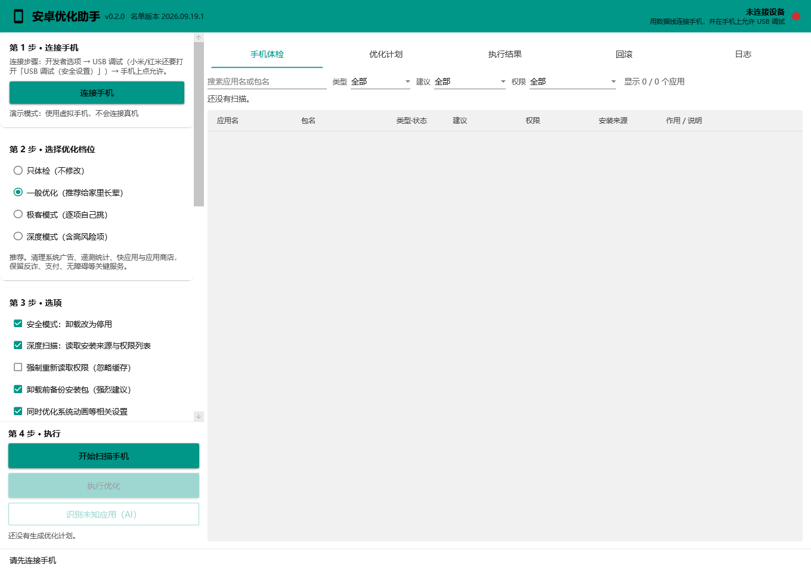
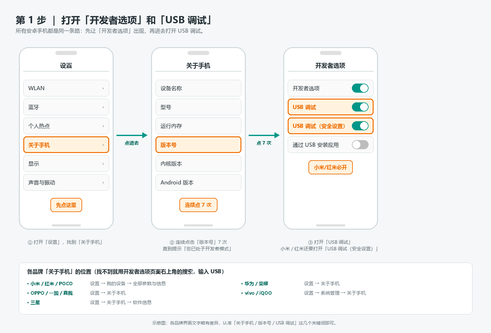
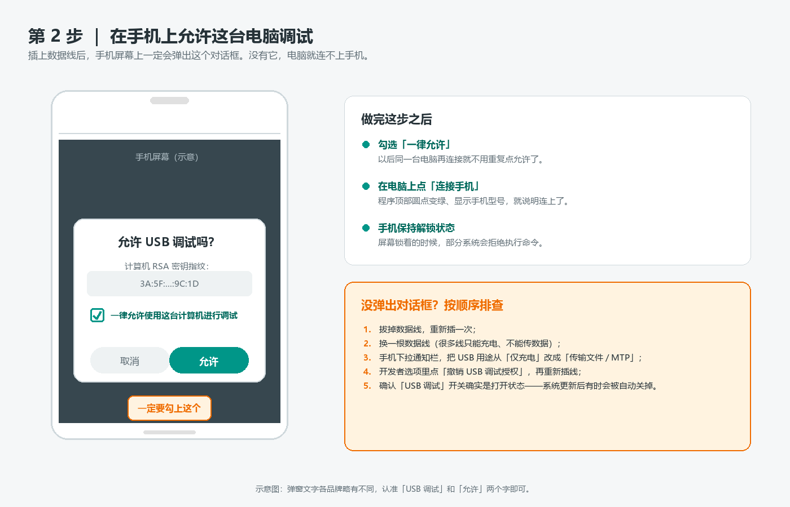
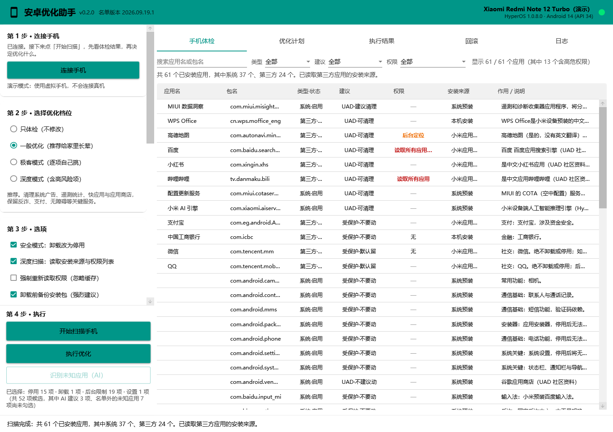
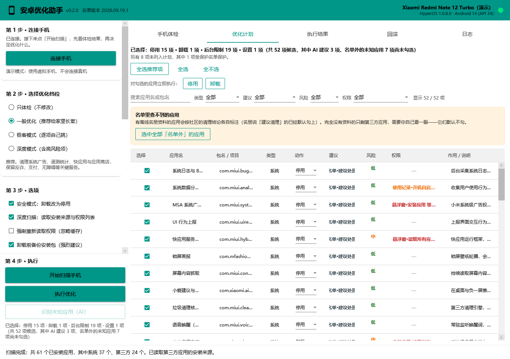
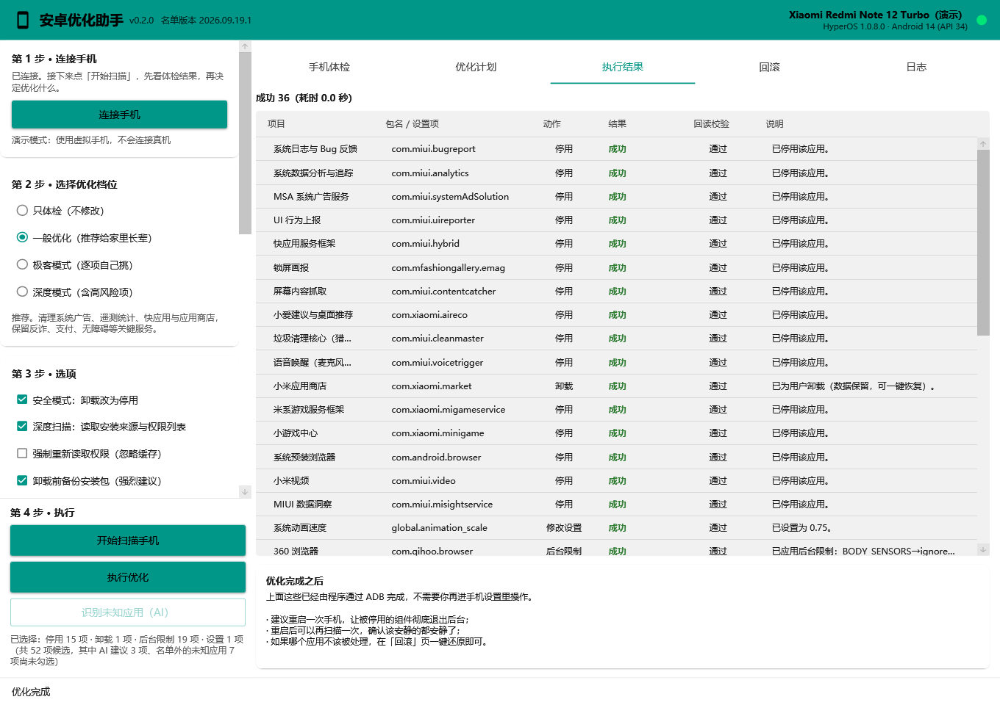
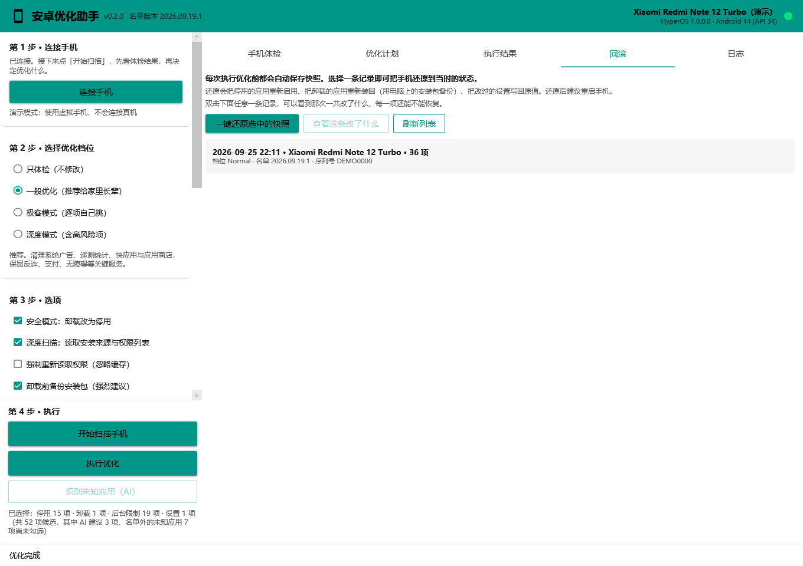
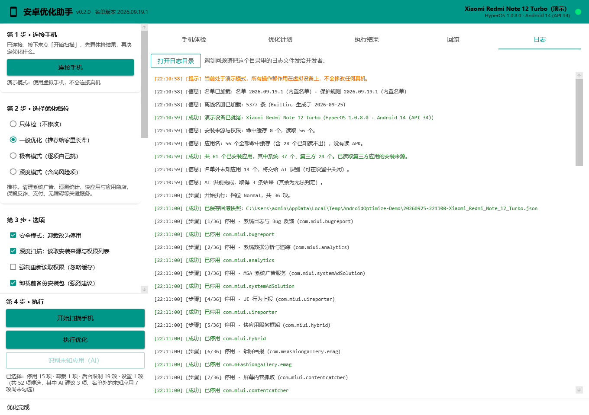

# 安卓优化助手

给家里长辈收拾安卓手机的小工具。**免 Root、免安装、一键优化、随时可退。**

很多国产安卓手机出厂就带着一堆会自己装应用、弹广告、后台耗电的东西，老人家往往不知道怎么关。
这个工具能把这些关掉——同时**坚决不碰**反诈、支付、输入法、电话短信这些底线应用。

这份文档包含了全部使用说明，不需要再看别的地方。

---

## 目录

- [一分钟上手](#一分钟上手)
- [第 0 步：下载和打开程序](#第-0-步下载和打开程序)
- [第 1 步：在手机上打开 USB 调试](#第-1-步在手机上打开-usb-调试)
- [第 2 步：连接手机](#第-2-步连接手机)
- [第 3 步：扫描手机](#第-3-步扫描手机只读不会改东西)
- [第 4 步：选要清理什么](#第-4-步选要清理什么)
- [第 5 步：执行优化](#第-5-步执行优化)
- [第 6 步：优化之后](#第-6-步优化之后)
- [出问题怎么还原](#出问题怎么还原)
- [它到底会动什么](#它到底会动什么)
- [给多台手机做优化：数据都存在哪](#给多台手机做优化数据都存在哪)
- [常见问题](#常见问题)
- [给开发者](#给开发者)

---

## 一分钟上手

1. 到本项目的 **Releases** 页面下载 `AndroidOptimize-x.x.x.exe`。
   这是**单个文件**，双击就能用——不用安装，不用装任何运行库。
2. 在手机上打开「USB 调试」（[第 1 步](#第-1-步在手机上打开-usb-调试)有图文）。
3. 插上数据线 → 点「连接手机」→ 点「开始扫描」→ 选好后点「执行优化」。

全程大约 10 分钟，只需要动手点几下。**做错了也能一键还原。**

---

## 第 0 步：下载和打开程序

### 下载

打开本项目的 **Releases（发行版）** 页面，下载最新版的 `AndroidOptimize-x.x.x.exe`。

这是一个**单文件程序**：只有这一个 exe，没有安装包，也不用装 .NET 之类的运行库。

### 打开

把 exe 放到任意文件夹（比如桌面），**双击**就能打开。

### 如果 Windows 弹出蓝色警告

第一次打开时，可能会看到「Windows 已保护你的电脑」或者「未知发布者」的提示。

这是因为程序没有购买商业代码签名证书（一年要几百到上千元）。处理办法：

> 点提示框里的 **「更多信息」** → 再点 **「仍要运行」**。

如果杀毒软件报警，把它加入信任列表即可。程序的全部源代码都在这个仓库里，可以随时核对。

### 打开后长这样



左边是操作区，按「第 1 步 → 第 4 步」从上往下做；右边是结果区，五个标签页分别是
手机体检、优化计划、执行结果、回滚、日志。

---

## 第 1 步：在手机上打开 USB 调试

所有安卓手机都是同一条路：**先让「开发者选项」出现，再进去打开 USB 调试。**



### 具体操作

**① 打开「设置」，找到「关于手机」**

各品牌的位置略有不同，对照下表找：

| 手机品牌 | 位置 |
|---|---|
| 小米 / 红米 / POCO | 设置 → 我的设备 → 全部参数与信息 |
| 华为 / 荣耀 | 设置 → 关于手机 |
| OPPO / 一加 / 真我 | 设置 → 关于本机 |
| vivo / iQOO | 设置 → 系统管理 → 关于手机 |
| 三星 | 设置 → 关于手机 → 软件信息 |

**② 连续点击「版本号」7 次**

一直点到屏幕下方提示「您已处于开发者模式」为止。中间可能要求输入锁屏密码，正常输入即可。

> 找不到「版本号」？看看是不是叫「MIUI 版本」「软件版本号」「内部版本号」——都是它。

**③ 返回设置，进入「开发者选项」，打开「USB 调试」**

### ⚠️ 小米 / 红米 / POCO 用户请务必注意

小米系的手机在开发者选项里还有**两个**开关，两个都要打开：

1. **USB 调试**
2. **USB 调试（安全设置）** ← 这个不开，优化时会一直提示「权限不足」

打开第二个开关时，可能需要登录小米账号并插入 SIM 卡，按提示操作即可。

### OPPO / vivo 用户建议

开发者选项里如果有「通过 USB 安装应用」「通过 USB 修改权限」之类的开关，一并打开。

> **小技巧**：找不到某个开关时，在开发者选项页面右上角点搜索图标，输入 `USB`，
> 所有相关开关都会列出来。

---

## 第 2 步：连接手机



### 步骤

1. **用数据线把手机连到电脑。**

   > ⚠️ 很多数据线是「只能充电、不能传数据」的。如果怎么都连不上，**换一根线**再试，
   > 这是最常见的原因。

2. **手机屏幕上会弹出「允许 USB 调试吗？」**

   勾选 **「一律允许使用这台计算机进行调试」**，再点 **「允许」**。

   > 勾上「一律允许」以后，同一台电脑再连接就不用重复点了。

3. **在电脑上点左侧的「连接手机」。**

   顶部右上角的圆点从红色变绿色，并显示出手机型号，就说明连上了。

### 一直连不上？按顺序排查

1. 拔掉数据线，重新插一次；
2. 换一根数据线；
3. 手机下拉通知栏，把 USB 用途从「仅充电」改成「传输文件 / MTP」；
4. 开发者选项里点「撤销 USB 调试授权」，再重新插线；
5. 确认「USB 调试」开关确实是打开的——系统更新后它有时会被自动关掉；
6. 手机保持**屏幕解锁**状态。

程序连不上时会直接告诉你卡在哪一步，照着提示做就行。

---

## 第 3 步：扫描手机（只读，不会改东西）

点左侧的 **「开始扫描手机」**。

**这一步不会修改手机上的任何东西**，可以放心点。扫描过程大约 10~60 秒（取决于手机里装了多少应用）。

扫描完成后会自动跳到「优化计划」页，你也可以点回「手机体检」页看完整清单：



### 这张表怎么看

| 列 | 含义 |
|---|---|
| **应用名** | 应用在手机桌面上显示的名字，例如「淘宝」「极速清理大师」。**这是程序从应用本身读出来的，不是猜的** |
| **包名** | 应用在系统里的唯一名字，例如 `com.xiaomi.market` |
| **类型·状态** | 系统应用还是第三方应用，现在是启用还是停用 |
| **建议** | 程序推荐怎么处理，见下表 |
| **权限** | 这个应用申请了哪些**值得警惕的权限**（悬浮窗、安装应用等），见下一节 |
| **安装来源** | 这个应用是从哪装进来的。**判断「是不是被强行装的」主要看这一列** |
| **作用 / 说明** | 这个应用是干什么的。名单里有的写名单的资料，没有的写装入时间与启动情况 |

「建议」这一列的取值：

| 显示 | 意思 |
|---|---|
| **受保护·不要动** | 支付、反诈、输入法、电话短信这类底线应用，任何档位都不会碰 |
| **受保护·默认留** | 微信、QQ 这类：默认不出现，要手动解锁才会进候选 |
| **名单·建议处理** | 名单里有记录，属于一般优化会处理的内容 |
| **名单·按需处理** | 名单里有记录，属于极客档的可选项 |
| **名单·保留** | 名单里明确标注「已评估、不要动」 |
| **UAD·建议清理** | 离线名册（UAD 社区）认为可以安全移除，**默认已勾选** |
| **UAD·可清理** | 名册认为可以移除，但请先确认，默认不勾 |
| **UAD·不建议动** | 名册认为需要专业判断，只在极客档出现 |
| **UAD·不要动** | 名册认为不该移除，不会进优化计划 |
| **名单外·自行判断** | 名单和名册里都没有，程序不知道它是什么。会进「未知应用」，也可以用 AI 识别 |

列表上方有四个筛选：**搜索框**（应用名或包名）、**类型**（全部 / 系统应用 / 第三方应用）、
**建议**（只看「建议清理」或只看「名单外」）、**权限**（只看申请了某个权限的应用，见下一节）。
表格默认按建议排序，能处理的排在前面；筛选结果旁边会显示「显示 12 / 168 个应用（其中 5 个含高危权限）」，
点表格任意一列的表头可以换排序方式。

> 程序里**没有白名单/黑名单**这种东西。每一条的处理建议都必须有出处——
> 要么是名单里的明确规则，要么是名册里的社区结论；拿不出依据的就写「名单外·自行判断」，
> 交给你决定。默认勾选也只看这一列，不会因为「它不在某个清单里」就自动处理。

> 💡 鼠标停在任意一行上，会浮出这个应用的完整信息，包括安装来源和**首次安装时间**。
> 如果某个你没印象的应用是最近才装的、来源又是应用商店，那它很可能就是「被强行安装」的。

> 🔍 **应用名是怎么来的**：程序直接从手机里的 APK 读出它的名字，
> 不需要联网、不需要 AI Key，名单里没有的应用也能显示。
> **第一次扫描会因此慢一些**（1~2 分钟，每个应用只传几百 KB），读完会缓存起来——
> 之后每次扫描只要几秒。读不出名字的应用（多是系统内部组件，它们本来就没有名字）
> 也会被记住，不会拖慢后面的扫描。缓存放在 `%LOCALAPPDATA%\AndroidOptimize\label-cache.json`，
> 删掉它就会重新读一遍；应用更新后也会自动重读。

### 「权限」列怎么用

用户装了什么应用是可以骗人的（名字可以起得很像正规软件），但**它要什么权限骗不了人**。
这一列把每个应用申请的权限里，**值得警惕的那几条**挑出来显示：

| 权限 | 为什么值得警惕 |
|---|---|
| **悬浮窗** | 可以在其它应用上层弹窗——悬浮广告、诱导点击的常用手段 |
| **安装应用** | 可以自己拉起安装别的应用——「被强行装应用」的核心能力 |
| **读取所有应用** | 可以扫描手机里装了哪些应用——推广和互相唤醒的常见做法 |
| **无障碍** | 可以模拟点击、读屏幕内容——被滥用后危害很大 |
| **读取短信** | 涉及验证码安全 |
| 使用记录 / 开机自启 / 修改系统设置 / 创建桌面图标 / 读取设备信息 / 后台定位 / 读取联系人 / 全屏通知 / 常驻唤醒 | 中风险：单独看都正常，凑在一起就说明这个应用不太安分 |

颜色：**红色**=含高危权限，**橙色**=只有中风险，**灰色**=没有命中，**「—」**=这台设备没给出权限列表。
鼠标停在「权限」列上，会列出它申请的**全部权限**，以及每一条为什么值得警惕。

最常用的用法是在**权限**筛选里选 **「悬浮窗+安装应用」**——既要弹窗、又能自己装应用，
这类基本就是推广/流氓应用，跟老人在手机上遇到的情况高度吻合。
（「含高危权限」范围更宽，适合先扫一眼全貌；它会把只申请了单条权限的应用也算进去，
实测能命中一半以上的应用，想直接下手就用组合项。）
也可以按单一权限筛，例如只看申请了「悬浮窗」的应用。

> ⚠️ 两件必须说清楚的事：
>
> 1. **这一列不会自动勾选任何东西。** 一个正经应用也可能申请悬浮窗（输入法的悬浮键盘、
>    录屏工具、车载投屏），光凭权限就决定删不删，等于换一种瞎猜。它只帮你**找**，
>    删不删还是你看过之后再决定。
> 2. **权限是「深度扫描」时一起读出来的。** 如果左侧把「深度扫描」关掉了，这一列会全是「—」，
>    那不是「这个应用很干净」，而是**没有读到**。筛选里专门有一个「未读取」选项用来区分这两种情况。

---

## 第 4 步：选要清理什么



### 先选档位（左侧「第 2 步」）

| 档位 | 适合谁 | 会做什么 |
|---|---|---|
| **只体检** | 想先看看 | 只扫描，不改任何东西 |
| **一般优化** ⭐ | 给长辈用 | 清掉系统广告、统计上报、快应用、应用商店、预装娱乐类应用 |
| **极客模式** | 你自己用 | 在一般优化的基础上，多出云服务、互联互通、语音助手等可选项 |
| **深度模式** | 明白风险 | 含高风险项，逐项确认 |

**给长辈用，选「一般优化」就够了。**

### 再看「优化计划」页

每一行就是一项操作，最左边有勾选框。**只有勾上的才会执行。**

| 列 | 说明 |
|---|---|
| **选择** | 勾上才会执行这一项 |
| **名称 / 包名** | 要处理的是哪个应用 |
| **类型** | 系统应用还是第三方应用 |
| **动作** | 停用 / 卸载 / 后台限制 / 修改设置。**要处理的应用可以直接在这一行选「停用」还是「卸载」** |
| **建议** | 和「手机体检」页完全一致的结论，两个页面看到的是同一句话 |
| **风险** | 绿=低，橙=中，红=高。**红色的默认不勾，需要你自己判断** |
| **权限** | 和「手机体检」页同一套权限画像（悬浮窗、安装应用这类高危权限） |
| **作用 / 说明** | 为什么建议处理、处理完会失去什么 |

上面的按钮：

- **全选推荐项**：把所有安全项勾上（推荐）。
- **全选 / 全不选**：字面意思。
- **对勾选的应用立即执行：停用 / 卸载**：勾好要处理的应用，点这两个按钮**马上就做**（会先弹窗确认）。

### 停用还是卸载，可以自己定

两种用法，看你要哪种：

**① 勾选几个应用，点按钮立刻执行（最常用）**

列表上方有「对勾选的应用立即执行：**停用** / **卸载**」。点下去会：

1. 弹窗列出即将处理的清单（应用名 + 动作），**确认之后**才动手；
2. 自动保存快照 → 逐项执行 → **回读手机确认真的生效**（不是看命令有没有报错）；
3. 弹窗给出结果：成功几项、降级几项、失败的是哪几个，并跳到「执行结果」页；
4. 自动重新扫描一次，刚处理掉的应会从计划里消失。

**② 在「动作」列的下拉框里改，最后统一点「执行优化」**

动作列是个下拉框，把某一行改成停用还是卸载，改完一起执行。适合一次处理很多、想先对着清单核对一遍的情况。

| 动作 | 效果 | 能不能还原 |
|---|---|---|
| **停用** | 应用不能再运行、图标消失、不会再弹广告 | ✅「回滚」页一键启用 |
| **卸载** | 为该用户卸载（保留应用数据），比停用更彻底 | ✅「回滚」页装回来，数据还在 |

几点说明：

- **两个按钮只处理你勾选的应用**，没勾的不动。
- 「后台限制」这类行虽然没有下拉框，但**勾上它再点按钮一样管用**——那是按应用本身停用/卸载，比只限制后台更彻底。
  「修改设置」是设置项、不是应用，按钮会跳过它。
- 手动选的动作是**你的明确决定**：安全模式不会把它降级。比如某个应用默认是「停用」，
  你选了「卸载」，程序就真的去卸载。
- 系统不允许卸载的应用，程序会自动降级为停用，并在「执行结果」页显示「已降级成功」。

> 筛选之后**批量勾选只作用于筛选出来的那些行**，被筛掉的行一个都不会被改动。
> 筛选条件旁边会写着「显示 12 / 96 项（其中已勾选 3 项）—— 上方「全选 / 全不选 / 全选推荐项」
> 只作用于这 12 项」，执行前可以对照着确认。
> 例如：在**权限**里选「含高危权限」，再点「全选」，就是把这次筛出来的可疑应用一次勾上。

### 名单里查不到的应用怎么办

程序内置了一份**离线名册**（5000+ 条，来自 UAD 社区），里面写着每个系统组件是干什么的、
社区认为能不能删。扫完之后：

- **「作用 / 说明」列**告诉你这个应用是干什么的；
- **「建议」列**直接给出能不能动的结论；
- **名册说「建议清理」的会自动勾上**，其余的自己看一眼再决定。

| 建议列显示 | 含义 | 默认勾选 |
|---|---|---|
| **UAD·建议清理** | 社区认为可以移除，**而且它桌面上没有图标**（用户根本打不开，是后台的推广/统计组件） | ✅ 自动勾选 |
| **UAD·可清理** | 社区认为可以移除，但需要先确认（例如它在桌面上有图标，使用者可能在用） | ⬜ |
| **UAD·不建议动** | 需要专业判断，只在极客档出现 | ⬜ |
| **UAD·不要动** | 社区认为不该移除 | 不进计划 |

> **UAD** = Universal Android Debloater，一个长期维护安卓预装应用清单的开源社区。
> **这些结论来自他们，不是本项目的判断**，界面上会如实标注。
>
> ⚠️ 需要说明的是，UAD 说「Recommended」的意思是**「删了不会搞坏手机、还能从商店装回来」**，
> 而不是「这是垃圾」。OEM 预装的 WPS、高德地图同样会被它标成 Recommended。
> 所以程序**只会自动勾选那些桌面上没有图标的应用**——使用者打都打不开的，才可能是纯后台的推广组件；
> 有图标的，一律交给你自己判断。

**名册完全没有覆盖的应用**（地方政务、社区服务、医院自建 App 这类第三方应用），
程序只能给出名字、安装来源、装入时间和启动记录，需要你自己看一眼。
它们默认**不勾选**，可以点「选中全部「名单外」的应用」一次勾完，再取消掉要紧的。

处理方式一律是**停用**而不是卸载：不能再运行、图标消失、不会再弹广告，
效果和卸载一样，但随时能在「回滚」页一键还原。

> **为什么不做「白名单之外全部删除」**：早先的版本试过，结论是白名单永远写不全——
> 地方政务、社区服务、医院自建 App 的包名毫无规律，写漏一个就是误删。
> 现在的依据换成「名册里有明确结论」，宁可少勾，也不猜。

### 左侧「第 3 步」的几个开关

- **安全模式：卸载改为停用** ✅ 建议保持勾选。
  停用比卸载更容易恢复，也不会触发系统自动把应用装回来。效果对使用者来说是一样的。
  > 例外：**应用商店不受这一条影响，会被直接卸载**——停用有可能被系统重新启用，而商店正是
  > 「被强行装应用」的源头，所以程序对它始终执行卸载。
- **深度扫描：读取安装来源与权限列表** ✅ 建议勾选。
  会多花 10~30 秒，但能查出每个第三方应用是从哪装进来的，以及它申请了哪些权限
  （「手机体检」页的**权限**列、「含高危权限」筛选都靠它）。
- **强制重新读取权限（忽略缓存）** ⬜ 默认关闭。
  权限与安装来源会缓存起来，**重复扫描只要 1 秒左右**（这些信息只随应用更新变化，
  缓存是安全的）。只在需要「手机上此刻的真实状态」时才勾上——比如刚在手机里改过权限设置、
  刚装完应用。勾上后扫描会慢一些（每个应用都要重新读一遍）。
- **卸载前备份安装包（强烈建议）** ✅ **默认开启，别关**。
  商店安装的应用被卸载时，系统会把安装包一起删掉——没有备份就永远装不回来。
  详见[关于「卸载」能不能恢复](#️-关于卸载能不能恢复必须说清楚)。
- **同时优化系统动画等相关设置** ✅ 建议勾选。把系统动画调快到 0.75 倍，手感更跟手。
- **关闭第三方应用的传感器权限（防摇一摇广告）** ✅ 建议勾选。
  摇一摇跳转广告靠加速度传感器触发，关掉传感器访问能让它直接失效。
  **微信、QQ、地图导航、运动健康类应用会自动排除**，不受影响。
- **允许操作微信等受保护应用** ⬜ 默认关闭。
  打开后微信、QQ 才会出现在候选列表里，而且仍然需要你手动勾选。**平时不用开。**

### 关于 AI 识别（可选）

如果手机里有很多「名单外」的应用，可以填一个 DeepSeek API Key 让程序自动识别它们。

**不填也完全能用**，只是这些应用不会被自动判断。

填了之后请注意：

- 程序**只把「名单里查不到的应用包名」**发出去，不发联系人、照片、短信等任何个人数据；
- AI 的结果只会出现在「来源 = AI 建议」的行里，**默认全部不勾选**，必须你确认；
- AI **永远不能建议处理受保护的应用**（反诈、支付、输入法这些）；
- API Key 用 Windows 加密后只保存在你自己的电脑上。

---

## 第 5 步：执行优化

确认勾选无误后，点左侧的 **「执行优化」**，会弹出确认框，显示即将执行的内容。



执行时会发生这些事（都可以在「日志」页看到）：

1. **先保存快照**——把所有要改的项目记录成一个可还原的文件；
2. 逐项执行；
3. **回读手机状态做校验**——不是看命令有没有报错，而是重新读一遍手机，确认真的生效了。

执行完，「执行结果」页每一行都会显示：

- **结果**：成功 / 已降级成功 / 失败
- **回读校验**：通过 / 未确认
- **说明**：具体做了什么

如果某一项显示失败，通常是系统权限限制导致的，不影响其它项。程序会给出中文原因和处理建议。

> 「已降级成功」的意思是：这个应用系统不允许卸载，程序改成停用了——效果一样，也能一键还原。

---

## 第 6 步：优化之后

程序已经用 ADB 把该做的都做完了，**不需要你再进手机设置里点任何东西**。
具体处理了哪些内容，见[它到底会动什么](#它到底会动什么)。

接下来只剩两件小事：

- **重启一次手机**，让被停用的组件彻底退出后台；
- 重启后可以再打开程序扫描一次，确认该安静的都安静了。

如果发现哪个应用不该被处理，去[「回滚」页](#出问题怎么还原)还原就好。

---

## 出问题怎么还原

**这是本程序最重要的功能。** 每次执行优化前，程序都会自动保存一份「快照」。



### 还原方法

1. 插上手机，点「连接手机」；
2. 打开 **「回滚」** 页；
3. 在列表里选中要还原的那一次（按时间排列，最新的在最上面）；
4. **双击**这一条，可以在下面看到这次一共改了什么、每一项还能不能恢复；
5. 确认没问题后点 **「一键还原选中的快照」**。

程序会把：

- **停用的应用** → 重新启用
- **卸载的应用** → 用电脑上的安装包备份重新装回
- **改过的设置** → 写回原来的值

还原完成后建议重启一次手机，然后重新扫描确认。

### ⚠️ 关于「卸载」能不能恢复，必须说清楚

安卓的卸载分两种情况，程序在卸载前会把这一点讲明白（确认框里会写）：

| 应用类型 | 卸载后能不能装回来 |
|---|---|
| **系统预装应用**（系统分区上有内置副本） | ✅ 能。系统里还有一份，`一键还原` 直接装回 |
| **商店安装的应用**（安装包在 `/data/app`） | ⚠️ **系统会把安装包一起删掉**。只有在**卸载前备份到电脑**才装得回来 |

所以程序默认开启 **「卸载前备份安装包」**：卸载这类应用之前，先把安装包拉到电脑上
（`%LOCALAPPDATA%\AndroidOptimize\devices\<序列号>\apk-backup\<包名>\`），回滚时用备份装回去。

- **关掉这个开关的后果**：这类应用卸载后就真的没了，连本程序也救不回来，只能重新下载。
  确认框会明确警告，并建议你先打开它。
- **备份失败时会跳过卸载**（宁可不动，也不做不可逆的事），并在结果里写明原因。
- 备份会占电脑磁盘：大约是这些应用安装包的大小（几十 MB 到几百 MB 不等）。

> 这条是踩了坑之后补上的：早期版本对商店应用也直接用 `pm uninstall`，
> 结果卸载后 `/data/app` 里一个 apk 都不剩，`install-existing` 也救不回来——
> 有 9 个应用因此装不回去，只能重新下载。现在没有备份就不会卸。

### 什么情况需要还原

| 现象 | 处理 |
|---|---|
| 某个应用打不开了 | 回滚一次，或只还原那一个应用 |
| 收不到某个应用的通知 | 同上 |
| 想装新软件但商店被卸载了 | 回滚一次 → 装完软件 → 重新执行优化 |
| 手机出现其它异常 | 先回滚，再反馈给我们 |

---

## 它到底会动什么

### 默认会做的事

| 项目 | 说明 |
|---|---|
| 卸载应用商店 | 「被强行装应用」的最主要来源。唯一不受安全模式降级的条目——停用可能被系统重新启用 |
| 关闭系统广告与统计 | 系统广告服务、行为上报、锁屏画报、快应用框架等 |
| 关闭传感器权限（防摇一摇广告） | 除微信、QQ、地图导航、运动健康类应用外，其它第三方应用都会被关闭传感器访问 |
| 限制重度应用后台 | 抖音、拼多多、快手、淘宝等不再长时间后台拉流与唤醒（极客档可选） |

### 绝对不会动的东西

下面这些在「保护名单」里，**任何档位、包括 AI 建议在内，都不会去碰**：

**安全与民生**：国家反诈中心、各类反诈应用、手机管家、安全中心的安装校验组件、
支付与银行类应用、云闪付、政务与医保类应用、无障碍服务（TalkBack 等）。

**手机的基础功能**：电话、短信、联系人、桌面、系统界面、系统设置、
应用安装器、输入法、相机、相册、时钟、文件选择器、紧急呼叫、蓝牙、NFC。

**微信、QQ** 属于「受保护」级别：默认不出现、AI 不许建议；
即使你打开「允许操作受保护应用」，也还需要在深度模式下手动勾选才会生效。

### 操作范围

所有操作都只针对**当前用户空间**（`user 0`），不 Root、不动系统分区，也不会碰你的照片和聊天记录。

---

## 给多台手机做优化：数据都存在哪

给亲戚朋友挨个收拾手机时，数据是**按手机序列号分开存的**，插不同的手机不会互相覆盖：

```text
%LOCALAPPDATA%\AndroidOptimize\
├─ settings.json          全局设置（档位、API Key）—— 所有手机共用
├─ label-cache.json       应用名缓存 —— 所有手机共用，同一个应用只读一次
├─ ai-cache.json          AI 识别结果 —— 所有手机共用
├─ platform-tools\        内置的 adb
├─ devices\               每台手机一个目录
│   └─ <手机序列号>\
│       ├─ device.json        这台手机的档案：机型、系统版本、扫过几次、第一次见到的时间
│       ├─ scans\             每次扫描的完整记录（应用、安装来源、权限、建议），最多留 10 次
│       ├─ executions\        每次执行优化做了什么，最多留 20 次
│       ├─ snapshots\         回滚快照
│       └─ reports\           体检报告与执行报告
└─ stats\                 导出的数据统计
```

几个直接能回答你问题的地方：

| 想找什么 | 在哪里 |
|---|---|
| 应用名缓存 | `%LOCALAPPDATA%\AndroidOptimize\label-cache.json` |
| AI 识别缓存 | `%LOCALAPPDATA%\AndroidOptimize\ai-cache.json` |
| 某台手机的扫描记录 | `%LOCALAPPDATA%\AndroidOptimize\devices\<序列号>\scans\` |
| 某台手机的设备信息 | `%LOCALAPPDATA%\AndroidOptimize\devices\<序列号>\device.json` |

界面左下角 **「这台手机的数据」** 按钮会直接打开当前手机的目录。

> 「回滚」页只列**当前连接的这台手机**的快照——把 A 手机的快照还原到 B 手机上毫无意义，
> 还会出事，所以程序直接不让它出现在列表里。旧版本留在全局 `snapshots\` 里的快照仍然能用。

### 攒够数据之后，用它改进名单

点左下角 **「导出数据统计」**（命令行等价：`AndroidOptimize.exe --stats 统计.md`），
会把所有手机的档案汇总成一份 Markdown：

| 章节 | 用来干什么 |
|---|---|
| 机型与系统版本 | 看接触过哪些机器、哪些 ROM，判断规则该按品牌怎么分 |
| 建议分布 | 各档建议的占比，看名单覆盖得够不够 |
| **名单外的第三方应用** | **最该补进名单的一批包**，按出现在几台手机上排序 |
| 权限命中排行 | 校准 `permissionRisks` 的等级划分 |
| 还没收录的权限 | 新 `permissionRisks` 的候选（已滤掉联网、相机这类日常权限） |
| 危险组合命中 | 哪些应用同时要了「悬浮窗 + 安装应用」 |
| 「从未启动过」的应用 | 仅供参考（被其它应用唤醒也算启动过，不能当删除依据） |

每台手机只算**最近一次**扫描，免得反复优化同一台手机把它算重。

> ⚠️ 这份统计**不含序列号、联系人、短信等任何个人信息**，只有机型、系统版本、包名与权限名，
> 可以直接发给开发者用来改进名单。所有数据都只写在本机 `%LOCALAPPDATA%\AndroidOptimize`，
> 程序不会往任何服务器上传东西。不想要了就整个文件夹删掉。

---

## 常见问题

**Q：会把手机弄坏吗？**

不会。所有操作都只针对当前用户空间，完全不动系统分区，也不会 Root 手机。
停用和卸载都可以一键还原，而且程序在执行前一定会先保存快照。

**Q：需要 Root 吗？**

不需要。这就是这个工具的意义——用 ADB 就能做到以前只有 Root 才能做的事。

**Q：会删掉我的照片、微信聊天记录吗？**

不会。程序只处理应用本身和部分系统开关，不碰任何个人数据。卸载应用时也会用保留数据的参数。

**Q：优化完收不到微信消息了？**

微信默认在保护名单里，不会被动。如果你手动打开过「允许操作受保护应用」并对微信做了后台限制，
在「回滚」页还原一次即可恢复。

**Q：应用商店被卸载了，以后怎么装软件？**

三种办法：

1. 用手机浏览器下载安装包直接装（推荐，装完不受商店影响）；
2. 到「回滚」页还原一次，商店就回来了，装完再重新执行优化；
3. 需要商店时临时还原，长期不用就让它卸载着——卸载只针对当前用户空间，随时可恢复。

**Q：摇一摇广告真的能挡住吗？**

程序会关闭第三方应用的传感器访问权限（`BODY_SENSORS`、`HIGH_SAMPLING_RATE_SENSORS`、
`ACTIVITY_RECOGNITION`），摇一摇这类靠加速度传感器触发的跳转广告会因此失效。

**需要说明的是**：标准安卓并没有给加速度传感器设置权限门控，能关到什么程度取决于系统版本和厂商实现，
所以这一项**建议在真机上验证一次**——执行完在「执行结果」页看这一项的「回读校验」是不是通过，
然后实际打开几个应用试试摇一摇还灵不灵。如果系统不支持，程序会如实显示失败，不会假装成功。

**Q：优化完了广告还是很多？**

大概率是**应用内的开屏广告和弹窗**——这类广告由应用自己绘制，任何 ADB 工具都挡不住，
只能靠关闭该应用的通知权限、或者干脆卸载它。
如果某个应用本身就是广告重灾区，欢迎反馈给我们，我们会评估是否加进名单。

**Q：手机里被装了几十个没用的应用，能一次清掉吗？**

分两种情况：

- **系统预装的推广、统计、游戏中心这类**：程序内置的离线名册（UAD 社区，5000+ 条）
  认得它们，扫完会直接在「建议」列给出结论，**说「建议清理」的已经帮你勾好了**，点执行就行。
- **名册也查不到的第三方应用**：程序只能给出名字、安装来源、装入时间和启动记录。
  在「优化计划」页点「选中全部「名单外」的应用」可以一次勾完，然后扫一眼列表，
  把医院挂号、社区服务、子女给你装的软件取消勾选。

**更快的办法**：先在**权限**筛选里选「含高危权限」——又要悬浮窗、又要装应用、
又要读短信的那些应用会一次列出来，这类基本就是流氓推广应用，勾上处理掉即可，
正常应用很少会同时要这几样。剩下的再按上面的办法慢慢看。

两种情况用的都是**停用**，万一关错了，在「回滚」页一键还原就行，数据一点不丢。

**Q：怎么知道某个应用要了什么权限？**

「手机体检」页的**权限**列会显示它申请的可疑权限（悬浮窗、安装应用等），
鼠标停在上面能看到**全部权限**和每条权限的用途。筛选框里可以直接按「含高危权限」或某一条具体权限筛。
权限是在深度扫描时顺带读出来的，不需要额外操作，也不会因为读权限而多花多少时间。

**Q：提示「停用失败 / 权限不足」？**

多半是没打开「USB 调试（安全设置）」，见[第 1 步](#第-1-步在手机上打开-usb-调试)的说明。

**Q：换了一台手机，之前的设置还在吗？**

在。优化档位、勾选项、AI 设置都保存在电脑上（`%LOCALAPPDATA%\AndroidOptimize`），
换手机不受影响。每台手机的快照是分开记录的。

**Q：程序的数据和日志在哪？**

都在 `%LOCALAPPDATA%\AndroidOptimize` 目录下（在文件管理器地址栏粘贴这个路径即可打开）：
日志、缓存，以及按手机序列号分开的 `devices\<序列号>\`（设备信息、扫描记录、快照、报告）。
详见[给多台手机做优化](#给多台手机做优化数据都存在哪)。卸载程序时直接删掉这个文件夹就行。

反馈问题时，请把「日志」页里的日志文件发出来。



**Q：没有手机，想先看看程序长什么样？**

在命令行里执行 `AndroidOptimize.exe --demo`，程序会用一台**虚拟手机**演示完整流程，
不会连接任何真机，也不会修改任何东西。

---

## 给开发者

> 上面是面向使用者的完整说明。目录结构、构建打包、名单格式、发布流程等开发者内容在
> [`docs/`](docs/) 目录里。

---

## 许可

见 [LICENSE](LICENSE)。内置的 ADB 来自 Google Android SDK Platform-Tools，随附 [NOTICE](vendor/platform-tools/NOTICE.txt)。
